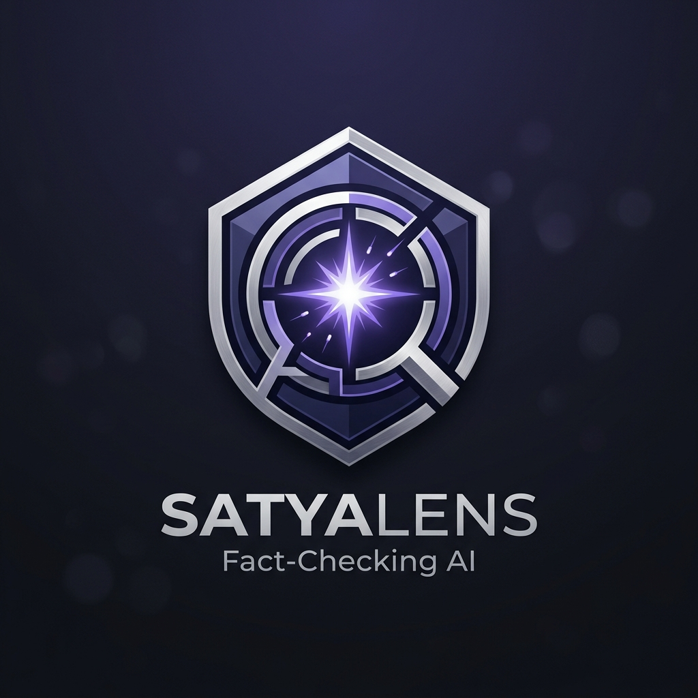
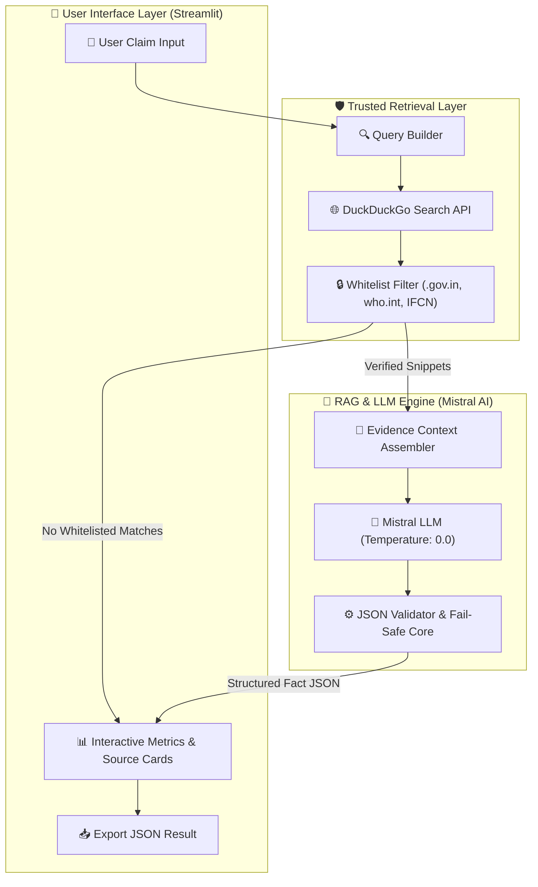
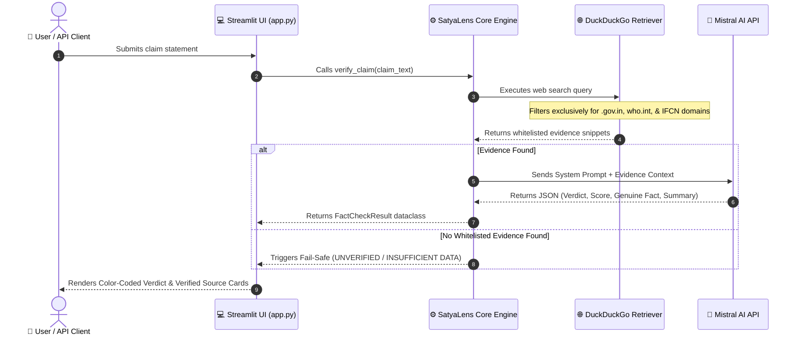

<div align="center">

  

  # 🔍 SatyaLens
  ### *The Unbiased Truth Lens for Misinformation Detection*

  [](https://python.org)
  [](https://streamlit.io)
  [](https://mistral.ai)
  []()
  []()
  [](LICENSE)

  <p align="center">
    <b>SatyaLens</b> is an end-to-end, zero-hallucination fact-checking application that verifies viral claims, social media rumors, and news statements strictly against <b>official Government portals</b> and <b>IFCN-certified fact-checking networks</b>.
  </p>

  <p align="center">
    <a href="#-key-features">Key Features</a> •
    <a href="#-system-architecture">Architecture</a> •
    <a href="#-live-ui--verdict-preview">UI Preview</a> •
    <a href="#-quick-start">Quick Start</a> •
    <a href="#-trusted-domain-shield">Trusted Whitelist</a> •
    <a href="#-python-sdk-usage">Python SDK</a>
  </p>

---

</div>

## 💡 Why SatyaLens?

In an era dominated by deepfakes, sensationalized media, and rapid viral rumors, standard LLMs often **hallucinate** or reproduce biased reporting found across unverified commercial sites. 

**SatyaLens solves this with strict cryptographic-like source integrity:**
- ⛔ **Zero Commercial Media Bias**: Commercial news networks and clickbait sites are completely filtered out.
- 🏛️ **Government & IFCN Integrity**: Claims are checked **ONLY** against `.gov.in`, `.nic.in`, official international bodies (WHO, UN, CDC), and IFCN-certified independent fact-checkers (AltNews, BOOM Live, Reuters, Factly).
- 🛡️ **Zero-Hallucination Policy**: Internal LLM parametric memory is bypassed. If no explicit evidence is retrieved from whitelisted sources, SatyaLens returns a strict **UNVERIFIED** verdict.

---

## ✨ Key Features

| Feature | Description | Benefit |
| :--- | :--- | :--- |
| **🛡️ Whitelisted Retrieval** | Restricts DuckDuckGo searches exclusively to verified government & IFCN domains. | Eliminates media bias & opinion pieces |
| **⚡ RAG Architecture** | Retrieval-Augmented Generation feeds raw evidence snippets directly into Mistral AI. | Factual accuracy grounded in empirical evidence |
| **🤖 Mistral LLM Core** | Leverages `mistral-small-latest` or `mistral-large-latest` with strict temperature (`0.0`). | Deterministic, highly consistent reasoning |
| **🎨 Dark Theme UI** | Sleek Streamlit interface inspired by Perplexity AI & Claude with metallic glassmorphism. | Modern, immersive, and responsive UX |
| **🔒 Fail-Safe Engine** | Automatically falls back to `UNVERIFIED / INSUFFICIENT DATA` when evidence is missing. | Prevents false positives or guesswork |
| **📦 JSON & SDK Ready** | Returns structured JSON outputs for easy integration into web apps, bots, or pipelines. | Plug-and-play developer experience |

---

## 🏗️ System Architecture & Workflow

SatyaLens operates as a decoupled RAG (Retrieval-Augmented Generation) pipeline combining strict domain filtering, zero-shot web retrieval, and deterministic LLM verification.

### 🏛️ System Architecture Component Diagram



### 🔄 End-to-End Verification Workflow



---

## 🎨 Live UI & Verdict Preview

SatyaLens formats claims into intuitive, color-coded verdict badges paired with detailed analytical breakdowns and clickable primary source links.

### 🚦 Verdict Spectrum

```
  🟢  GENUINE / TRUE             The claim is fully validated by official government releases or IFCN reports.
  🔴  FAKE / FALSE               The claim has been explicitly debunked by official sources.
  🟧  MISLEADING                 The claim contains selective truth mixed with distorted context.
  🩶  UNVERIFIED DATA            No evidence found in trusted whitelisted domains (Fail-safe trigger).
```

### 💻 UI Output Breakdown

```
┌────────────────────────────────────────────────────────────────────────────────────────┐
│  🟢 VERDICT: GENUINE / TRUE                           CONFIDENCE SCORE: 96%             │
├────────────────────────────────────────────────────────────────────────────────────────┤
│  📌 GENUINE FACT STATEMENT                                                             │
│  "The Reserve Bank of India has officially announced new guidelines regarding..."      │
│                                                                                        │
│  📝 FACT CHECK SUMMARY                                                                 │
│  Based on official press releases from pib.gov.in and rbi.org.in, the policy was       │
│  ratified on August 10, 2026. Commercial media claims of immediate bans are false.      │
│                                                                                        │
│  🔗 VERIFIED SOURCES                                                                   │
│  • Press Information Bureau [pib.gov.in]                                               │
│  • Reserve Bank of India Official Portal [rbi.org.in]                                  │
└────────────────────────────────────────────────────────────────────────────────────────┘
```

---

## 🛡️ Trusted Domain Shield

SatyaLens enforces strict domain whitelisting across 3 primary pillars:

<details open>
<summary><b>🇮🇳 Indian Government & Regulatory Portals</b></summary>

- `pib.gov.in` (Press Information Bureau)
- `factcheck.pib.gov.in` (PIB Fact Check Unit)
- `india.gov.in` (National Portal of India)
- `rbi.org.in` (Reserve Bank of India)
- `sebi.gov.in` (SEBI)
- `isro.gov.in` (ISRO)
- `icmr.gov.in` (ICMR)
- `mohfw.gov.in` (Ministry of Health)
- All `.gov.in`, `.nic.in`, and `.edu.in` TLDs
</details>

<details open>
<summary><b>🌐 International Government & Global Bodies</b></summary>

- `who.int` (World Health Organization)
- `un.org` (United Nations)
- `cdc.gov` (Centers for Disease Control and Prevention)
- `nih.gov` (National Institutes of Health)
- `ec.europa.eu` (European Commission)
- `worldbank.org` & `imf.org`
</details>

<details open>
<summary><b>🛡️ IFCN Certified Fact-Checkers</b></summary>

- `factly.in` (Factly India)
- `boomlive.in` (BOOM Live)
- `altnews.in` (Alt News)
- `newschecker.in` (NewsChecker)
- `reuters.com` (Reuters Fact Check)
- `apnews.com` (AP Fact Check)
- `snopes.com`, `factcheck.org`, `fullfact.org`, `politifact.com`
</details>

---

## 🚀 Quick Start

### Prerequisites
- **Python 3.8+** installed on your system.
- A free **Mistral AI API Key** ([Get your key here](https://console.mistral.ai/api-keys/)).

### 1️⃣ Clone & Navigate

```bash
git clone https://github.com/Narendra6305/SatyaLens.git
cd SatyaLens
```

### 2️⃣ Install Dependencies

```bash
pip install -r requirements.txt
```

### 3️⃣ Configure Environment

Create a `.env` file in the root directory (or copy `.env.example`):

```bash
cp .env.example .env
```

Add your API key into `.env`:

```env
# Required: Mistral AI API Key
MISTRAL_API_KEY=your_mistral_api_key_here

# Optional: LLM Selection (default: mistral-small-latest)
LLM_MODEL=mistral-small-latest
```

### 4️⃣ Launch Web Application

```bash
streamlit run app.py
```

🎉 Open your browser at `http://localhost:8501` to start fact-checking!

---

## 🐍 Python SDK Usage

You can seamlessly import and use **SatyaLens** inside your own Python projects or automation pipelines:

```python
from satya_lens_core import verify_claim, SatyaLens

# Method 1: High-level helper function
result = verify_claim("PIB announced new digital education initiative for rural schools")

# Print structured findings
print(f"Verdict     : {result.verdict}")
print(f"Confidence  : {result.confidence_score * 100}%")
print(f"Fact        : {result.genuine_fact}")
print(f"Summary     : {result.summary}")
print(f"Sources     : {len(result.verified_sources)} verified link(s) found")

# Method 2: Object-Oriented Instance
engine = SatyaLens()
fact_check = engine.verify("RBI releases circular on UPI credit line limits")
```

### 📊 JSON Output Schema

```json
{
  "verdict": "GENUINE / TRUE",
  "confidence_score": 0.95,
  "genuine_fact": "The Press Information Bureau confirmed the initiative on official channels.",
  "summary": "Official press release published on pib.gov.in validates the claim.",
  "verified_sources": [
    {
      "title": "Press Information Bureau - Official Release",
      "url": "https://pib.gov.in/PressReleasePage.aspx?PRID=123456"
    }
  ]
}
```

---

## ⚙️ Configuration Matrix

Customize SatyaLens settings in `config.py` or `.env`:

| Parameter | Default Value | Location | Description |
| :--- | :--- | :--- | :--- |
| `MISTRAL_API_KEY` | `""` | `.env` | Required Mistral API key |
| `LLM_MODEL` | `mistral-small-latest` | `.env` | Model choice (`mistral-small-latest`, `mistral-large-latest`) |
| `LLM_TEMPERATURE` | `0.0` | `config.py` | Strict temperature setting for deterministic output |
| `MAX_SEARCH_RESULTS` | `5` | `config.py` | Number of whitelisted search snippets fetched per claim |
| `MAX_SNIPPET_LENGTH` | `500` | `config.py` | Maximum character length per web snippet |

---

## 📂 Repository Layout

```
SatyaLens/
├── 📄 app.py                 # Perplexity-inspired Streamlit Dark UI
├── ⚙️ config.py              # Whitelisted domain arrays & model config
├── 🧠 satya_lens_core.py     # RAG pipeline, DDG retriever & Mistral engine
├── 🖼️ satyalens_logo.png     # Official SatyaLens logo emblem
├── 📋 requirements.txt       # Project dependencies
├── 🔒 .env.example           # Environment template
└── 📖 README.md              # Project documentation
```

---

## 🤝 Contributing

Contributions are warmly welcomed! If you wish to suggest additional government domains or IFCN-certified fact checkers:

1. Fork the Repository
2. Create a Feature Branch (`git checkout -b feature/AddTrustedDomain`)
3. Ensure proposed domains belong **strictly** to official government entities or IFCN-signatories.
4. Commit your changes (`git commit -m "feat: Add verified domain"`)
5. Push to Branch (`git push origin feature/AddTrustedDomain`)
6. Open a Pull Request

---

## 📄 License

This project is licensed under the **MIT License** — feel free to modify, distribute, and integrate.

---

<div align="center">

  **Built with ❤️ for Truth & Unbiased Fact Verification**
  <br />
  <sub>SatyaLens v1.0.0 • Powered by Mistral AI & DuckDuckGo Search</sub>

</div>
